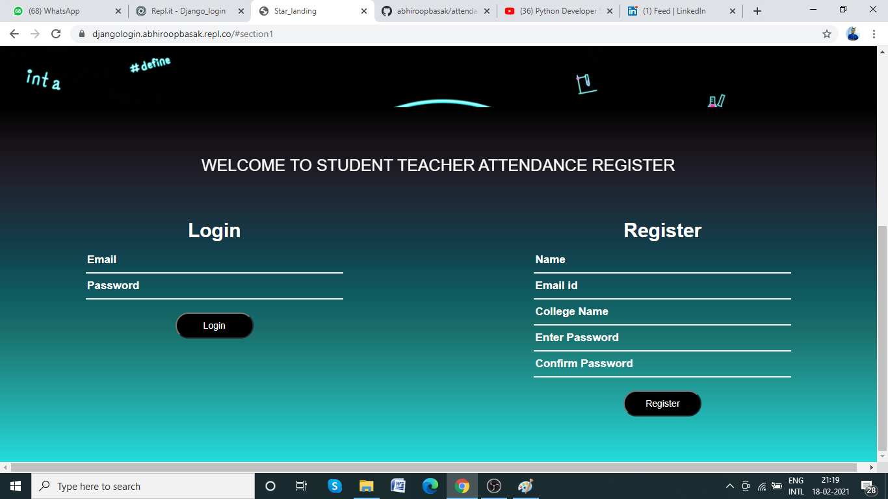
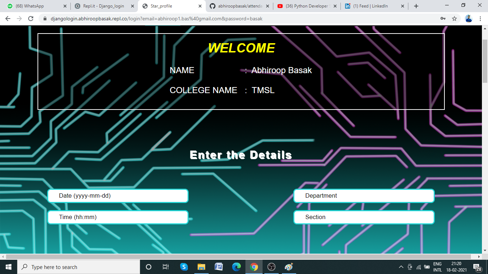
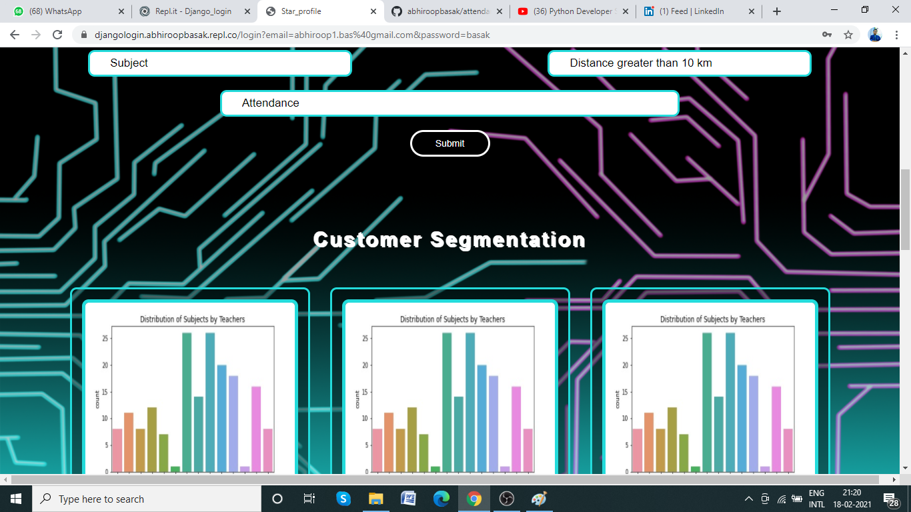
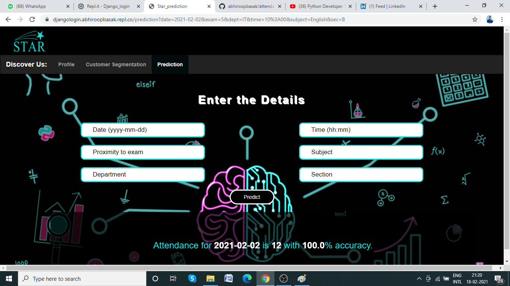

# Attendance Prediction Portal

## Technologies used

+ Django server

+ repl hosting

+ MongoDB Atlas

+ AWS S3 storage

+ HTML

+ CSS

+ JavaScript

+ JQuery

+ Machine Learning

## Project Objective

The project aims at creating a secure and personalized web portal for teachers to track a attendance for a particular class based on real time data or already stored data in the server. The program also enables user to predict the attendance expected on a particular day and a particular trends using a Machine Learning Model.

## Project Outcome

